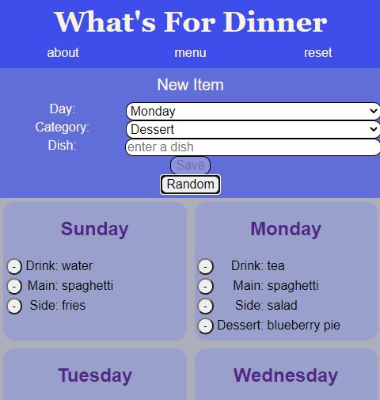

 # What's For Dinner
 
 https://whats-for-dinner-ten.vercel.app

App allows users to plan menus either by selecting and arranging dishes for their menu, or by using a random function to generate ideas to plan a menu around.
Meant to be a basic framework to allow for expansions to potentially include calorie counting, dietary filters and linked ingrediants to start a shopping list with.

(HTML/CSS/JavaScript/React/Node/Express/PostgreSQL)
